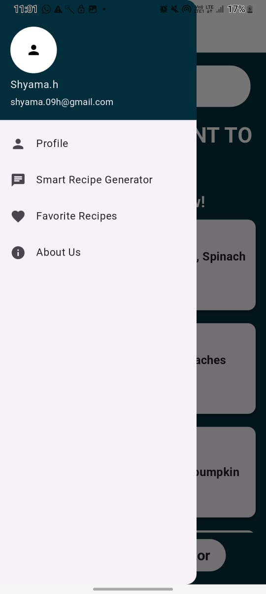
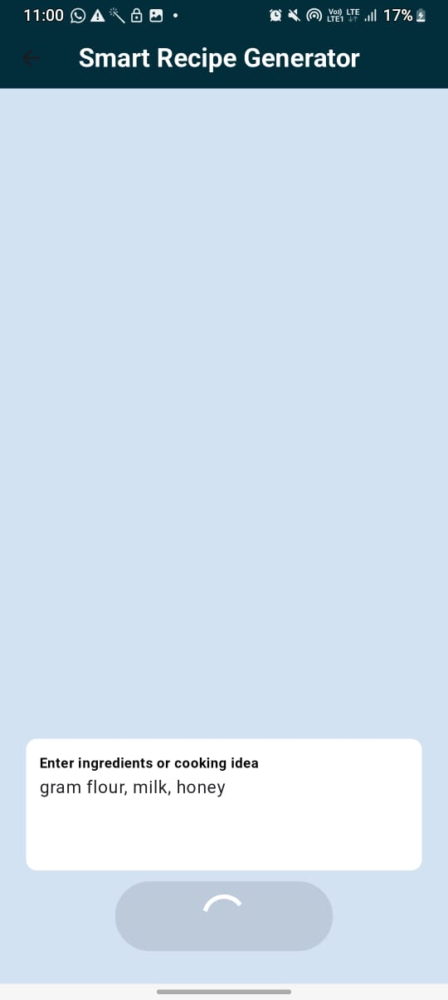
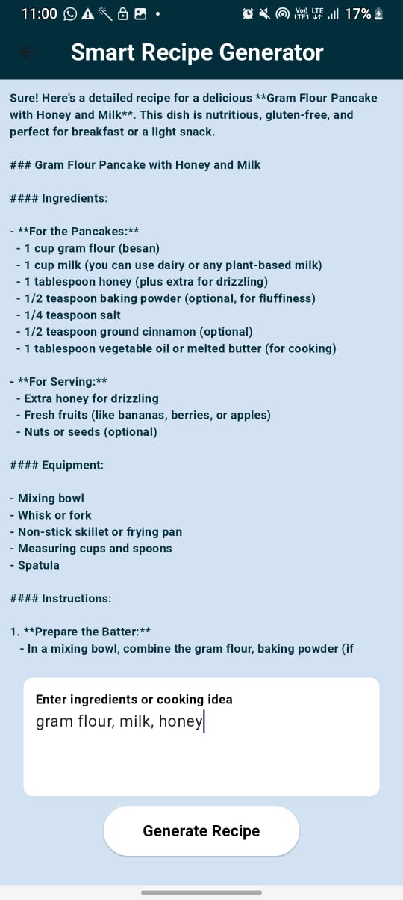

# ✨ MealX -Smart Recipe & Nutrition App

MealX is a Flutter-based smart recipe app that helps you discover delicious recipes with nutrition facts, calories, and an AI-powered Smart Recipe Generator. Enter your ingredients or preferences, and MealX will create custom recipes for you using the power of OpenAI.

---

## 📱 Screenshots

---

## 🚀 Features

🍲 Search recipes by ingredients

🧮 View calories and full nutrition breakdowns

🧑‍🍳 Generate unique recipes with AI prompts

📋 Add Recipes as your fav

💡 Smart and beginner-friendly Flutter UI
---

## 🔧 Technologies Used

Flutter 3.x

Dart

OpenAI API (Smart Recipe Generator)

REST APIs (for nutrition data)

Material Design

HTTP Package

---

## 🔐 API Key Setup

This project uses an AI API (OpenAI). For security reasons, the real API key is **not included** in this repository.

### ✅ Steps to Set Up:

1️⃣ Copy the file lib/services/secrets_sample.dart → rename it to secrets.dart
2️⃣ Inside secrets.dart, add your real OpenAI API key:

class Secrets {
  static const String openAiApiKey =
  "YOUR_OPENAI_API_KEY_HERE";
      
}

3️⃣ Your ai_recipe_service.dart will import this:

dart
Copy code
import 'secrets.dart';

class AIRecipeService {
  static const String _apiKey = openAIAPIKey;
  // ...
}
✅ secrets.dart is added to .gitignore to keep it safe and private.
